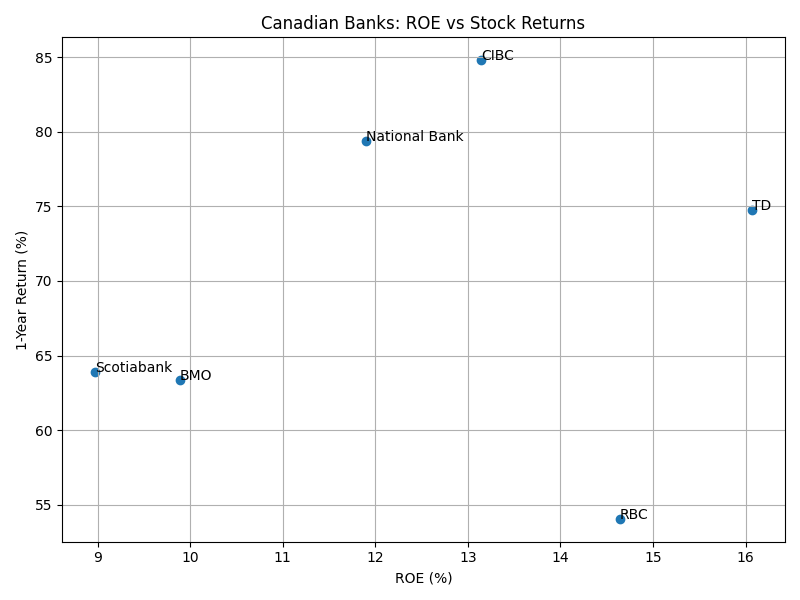

# Canadian Bank Analysis Pipeline

## Overview
This project builds a small financial analysis pipeline to evaluate major Canadian banks using both fundamental data and market performance.

The pipeline:
- pulls real financial data from Yahoo Finance
- cleans and processes the data
- calculates key financial metrics
- merges fundamentals with stock returns
- visualizes relationships between profitability and market performance

## Objective
The goal is to test whether more profitable banks (measured by ROE) deliver stronger stock returns.

## Banks Covered
- RBC
- TD
- Scotiabank
- BMO
- CIBC
- National Bank

## Data Sources
- Yahoo Finance (via `yfinance`)
  - financial statements
  - historical stock prices

## Pipeline Structure

### 1. Fundamentals ingestion
`src/fundamentals_api.py`
- pulls net income, total assets, and equity

### 2. Data cleaning
`src/inspect_fundamentals.py`
- validates data
- fixes missing values
- outputs cleaned dataset

### 3. Market data
`src/market_data.py`
- downloads stock prices
- calculates 1-year returns

### 4. Analysis
`src/load_data.py`
- computes ROE, ROA, leverage
- merges fundamentals with returns
- generates final dataset and visualization

## Key Metrics
- **ROE (%)** = Net Income / Total Equity
- **ROA (%)** = Net Income / Total Assets
- **Leverage** = Total Assets / Total Equity
- **1-Year Return (%)** = (Latest Price / First Price - 1) × 100

## Example Output

### ROE vs Stock Return


## Key Insight
There is a weak positive relationship between ROE and stock returns. Profitability contributes to performance, but does not fully explain it. Market expectations, risk, and growth outlook likely play a significant role.

## How to Run

1. Install dependencies:
```bash
pip install -r requirements.txt